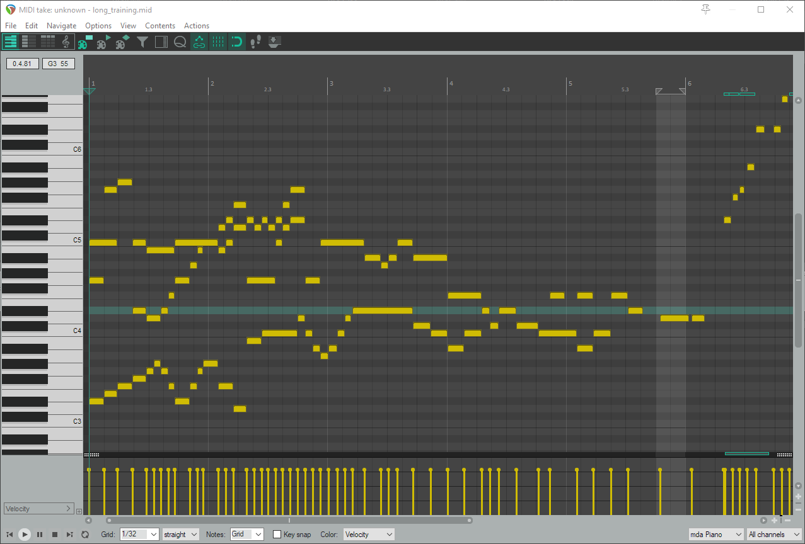

# DeusExBachina

|--|

As a musician of 19 years, I enjoy exploring the intersection between art and science. One could make the argument that math is how we interpret the natural phenomenon of music, while others could make the converse argument that music is an application of mathematics. That perspective was my motivation for this project: to see if I could teach a machine to be musical. In one sentence: I implemented a WaveNet-based Recurrent Neural Network that autoregressively generates new MIDI sequences. For the long-form, keep reading!

  

|--|

When first choosing what music I would use, I opted for Bach's Well-Tempered Clavier. This is a musical collection overstuffed with historical value. The finer points are beyond the scope of a data science project, but the bullet points are: 

1) It uses every key in Western harmony.
2) Being of the Baroque period, the compositional structure is less repetitive than more modern rondo (think A, B, A, C, A) style
3) Tempo and meter are varied but not the focus

The last bullet point is especially important, because for this machine to work as I wanted I had to make some presumptuous simplifications. These simplifications were precipitated by the transition from analog to digital in the form of Musical Instrument Digital Interface (MIDI).

|--|

The image above should aid in understanding what MIDI does. It maps signals from instruments to musical notes, enabling a synthesizer to trigger drum samples, for example. When I was creating the input for this model, I stripped the dynamic, meter, and 'control' values from the data. Control here has flexible meaning for MIDI, but usually in the context of a piano it refers to the footpedals that control dampening of the strings. While this can be used in a real-time scenario, the model training was performed offline (and still works as such). The final input for the model has only a 1-dimensional array of 1s and 0s, representing an 88-key piano with keys pressed (1) or not (0). The image at the start of this README is a screenshot of output from the model. The x-axis is time across the composition and the y-axis indicates keys activated at a given time. The 'pillars' at the bottom are indicative of the dynamics being forced to a single value for each note.

|--|
|
 The model sees only key states at a given time as pressed or not 
|

With the data processed and ready for training, I halted training after a day on my personal machine and listened to the output.

While it seemed to capture some of the style, the parallel motion giving way to simultaneous melodies, it lacks 'direction.' I played out a minute or so of audio and the model had entropied into prolonged silences or repeating a single motion like an ascending phrase. Because of the training speed, I transplanted the project to an AWS EC2 g4dn instance and trained again for nearly 2 days, halting the process at approximately 1600 epochs. I output another couple minutes of audio and felt there was a substantial improvement.

The model held more closely to the style of simultaneous but not parallel movement in the voices and did better about 'phrasing,' allowing pauses during play instead of leading every key press into another. It still eventually entropied into chromaticism as opposed to key changes and the sense of rhythm decayed over the duration too. All told, it felt like a good indication that more training was a good thing.

At least it was to my ear. The training loss plummeted and stayed low as one would hope, but the validation loss deviated pretty quickly after my first training session. It wound up oscillating around .09 to .10 and seemingly overfit the training data. I could not find a particular passage in the corpus of the Well-Tempered Clavier books that possessed the same phrases the model put out, but it had not learned fully how to do its job indefinitely. 

The first mistake I made was not transposing the compositions. While they are diverse, each has its own thematic elements and motifs, and I suspect the model was associating particular phrases with particular keys. The other mistake I made was not having made the model wide at all and not tuning hyperparameters before the longer training session.

Bottom line, I was pretty happy with how everything sounded, but I know there is a ton of work left in this project. I think it would be incredibly entertaining to have software that can autonomously create another piece by Beethoven, Wagner, Rachmaninov, etc. While it would be nice to generate non-piano music, too, I think the next step here will be to support performance attributes like dynamics, foot control, and potentially even rhythm/meter.

The tech stack in this project utilized several different packages and modules, but special thanks go to Thomas Angsten for his work in his [Medium article](https://towardsdatascience.com/generating-piano-music-with-dilated-convolutional-neural-networks-d81d02e1dda6). After scrapping my original capstone idea of instrument classfication, I would not have been able to catch up without all the prior work he put in.

